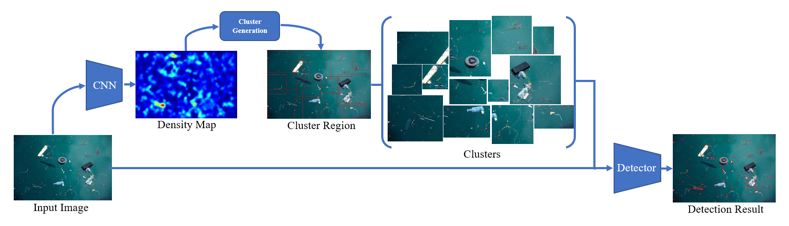
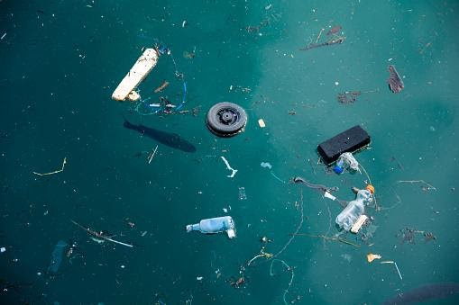

# DMNet-for-Marine-Debris-Detection

> **Note:** This is **not** the official repository for [CDMnet](https://ieeexplore.ieee.org/stamp/stamp.jsp?tp=&arnumber=9607840&fbclid=IwAR27cTIscjnq54a7CsZpp3f1WaGG1Setdouo1lUxnBLswvdQR4aHNZRCCdQ&tag=1) or [DMnet](https://github.com/Cli98/DMNet) ([paper pdf](https://par.nsf.gov/servlets/purl/10193024)).  
> Our project adapts these techniques for marine debris detection using aerial and underwater imagery.

---

## 🚀 Introduction

Detecting debris in marine environments from aerial or underwater images is a challenging task due to:

- **Small object size:** Most debris pieces are tiny compared to the background scene.
- **Uneven object distribution:** Objects are scattered unpredictably, making detection harder.

To address these, we leverage ideas from CDMnet and DMnet—architectures designed for efficient small object detection in urban aerial scenes—and adapt them for marine debris, which shares similar challenges.

<p align="center">
  
  <p align="center"><i>An overview of our framework</i></p>
</p>

---

## 🖼️ Samples

<p align="center">
  
  
</p>

---

## 🗺️ Density Map Generation

For density map generation, we utilize MCNN—a state-of-the-art architecture for crowd counting and density estimation.

- Code is adapted from Ma's [MCNN-pytorch](https://github.com/CommissarMa/MCNN-pytorch).
- The pretrained weights can be accessed [here]().

---

## 🎯 Object Detection

For real-time debris detection, we employ **Yolov7-tiny**, a lightweight and accurate object detector.

- Code is adapted from WongKinYiu's [Yolov7](https://github.com/WongKinYiu/yolov7).

---

## 🧩 Models & Resources

Directly apply our finetuned models for tiny marine debris detection:

| Resource                      | Download Link                                                                                          |
|-------------------------------|:------------------------------------------------------------------------------------------------------:|
| MCNN pretrained model         | [Download](https://github.com/HengWeiBin/DMNet-for-Marine-Debris-Detection/files/14354856/MCNN_weights.zip) |
| Finetuned Marine Debris YOLO  | [Download](https://github.com/HengWeiBin/DMNet-for-Marine-Debris-Detection/files/14354858/Yolov7_weights.zip) |
| Dataset                       | Not available                                                                                          |
| Yolov7-tiny Config            | [Download](https://github.com/HengWeiBin/DMNet-for-Marine-Debris-Detection/files/14354860/yolov7-config.zip) |

---

## ⚡ Usage

### 0. Prepare Your Dataset

> **Note:** Due to licensing, our dataset is not available for download.

- Prepare your own dataset with **point labels** (for MCNN training) and **annotation labels** (for Yolov7 training).

### 1. Training

Install required libraries:

```bash
pip install -r requirements.txt
```

- Use [MCNN-pytorch](https://github.com/CommissarMa/MCNN-pytorch) for density map training.
- Use [Yolov7](https://github.com/WongKinYiu/yolov7) for object detection training.
- Place your MCNN param file in `MCNN_weights/`
- Place Yolov7-tiny weights in `Yolov7_weights/`

### 2. Custom Inputs

Run detection on your images using the pretrained models:

```bash
python detect.py --img_dir samples/Trash.jpg --mcnn_param MCNN_weights/mcnn_marine_debris.param --yolo_weights Yolov7_weights/best.pt --half
```

---

## 🙏 Acknowledgements

- Inspired by [CDMnet](https://ieeexplore.ieee.org/stamp/stamp.jsp?tp=&arnumber=9607840&fbclid=IwAR27cTIscjnq54a7CsZpp3f1WaGG1Setdouo1lUxnBLswvdQR4aHNZRCCdQ&tag=1) and [DMnet](https://par.nsf.gov/servlets/purl/10193024).
- Density map code adapted from [MCNN-pytorch](https://github.com/CommissarMa/MCNN-pytorch).
- Detector code adapted from [Official YOLOv7](https://github.com/WongKinYiu/yolov7).

> Thanks to all contributors and the open-source community for their impactful work!

---

## 📫 Contact & Thank You

If you have questions, suggestions, or would like to collaborate, feel free to reach out:

- **GitHub:** [ShaikhNomaan-png](https://github.com/ShaikhNomaan-png)

Thank you for checking out this project! Your interest and support help drive innovation in environmental protection.  
Feel free to open issues or contribute to improving marine debris detection!

---
